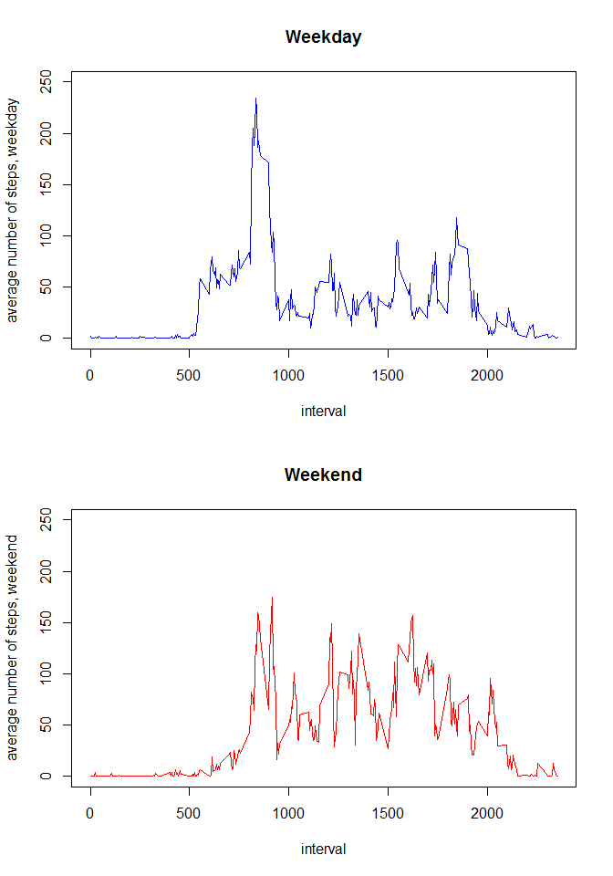

# Reproducible Research: Peer Assessment 1
Panagiotis Cheilaris  
2015-03-03  


## Loading and preprocessing the data


```r
zipfile = "activity.zip"
unzip(zipfile)
activity <- read.csv("activity.csv", header = TRUE)
```


## What is the mean total number of steps taken per day?

1. We use library dplyr to manipulate the data
and calculate the total number of steps taken per day.

```r
library(dplyr)
totperday <- activity %>% group_by(date) %>% summarize(tot=sum(steps))
```

2. Here is the histogram:

```r
hist(totperday$tot, main="Histogram of total number of steps per day",
     xlab="Total number of steps", labels=TRUE, ylim=c(0,40))
```

 

3. Here are the mean and median computations:

```r
meantotday <- mean(totperday$tot, na.rm=TRUE)
mediantotday <- median(totperday$tot, na.rm=TRUE)
options(scipen=100)
```

For the **total number of steps per day**,
the **mean** is 10766.1886792 and the **median** is 10765.

## What is the average daily activity pattern?

1. Here is the plot:

```r
meanperint <- activity %>% group_by(interval) %>% summarize(intmean=mean(steps, na.rm=TRUE))
plot(meanperint, type = "l", ylab = "average number of steps per interval")
```

 

2. The 5-minute interval with the maximum average number of steps is:

```r
meanperint[which.max(meanperint$intmean),]$interval
```

```
## [1] 835
```

## Imputing missing values

1. The total number of missing values in the dataset is:

```r
sum(is.na(activity$steps))
```

```
## [1] 2304
```

2. We will substitute each missing NA steps value with the average value
for the 5-minute interval from the previous part.


```r
fixstep <- function(inter, step) {
  if (is.na(step)) meanperint[which(meanperint$interval == inter),]$intmean else step
}
```

3. Here is the new dataset with the new column stepsfixed.

```r
activitywithoutna <- activity %>% transform( stepsfixed = mapply(fixstep, interval, steps) )
```

4. Here is the new histogram:

```r
totnewperday <- activitywithoutna %>% group_by(date) %>% summarize(tot=sum(stepsfixed))
hist(totnewperday$tot, main="Histogram of total number of steps per day (without NA)",
     xlab="Total number of steps (without NA)", labels=TRUE, ylim=c(0,40))
```

 

And here are the mean and median without NA:

```r
meantotnewday <- mean(totnewperday$tot, na.rm=TRUE)
mediantotnewday <- median(totnewperday$tot, na.rm=TRUE)
```
For the **total number of steps per day without NA**,
the **mean** is 10766.1886792 and the **median** is 10766.1886792.

The two mean values are the same (10766.1886792) and the new median value
is the same as the mean values. This happens because the NA values are in eight
days and these eight days have no non-NA value at all. As a result, the updated
mean for each of these eight days becomes 10766.1886792 (compare the two
histograms to see that the only difference is the middle rectangle with frequency
28 and 36) and the new mean for all days remains the same as the previously
computed mean. Moreover, the new median value is expected since there are eight
copies of 10766.1886792 in the data.

## Are there differences in activity patterns between weekdays and weekends?

1. We create the wkdtype variable in the new dataset activitywkd:

```r
convdaytype <- function(x) { if (x %in% c("Saturday", "Sunday")) "weekend" else "weekday" }
activitywkd <- activity %>%
  transform( wkdtype = as.factor(sapply(weekdays(as.Date(date)), convdaytype)) )
```

2. Here are the plots. As expected, we can see that activity on
work days starts earlier than weekends and it is also more intense
in the mornings, but it also finishes earlier and is less intense
in the night. Moreover, in weekends activity is more balanced
through the day, whereas for work days there is a spike in the
morning.

```r
meanperintwkd <- activitywkd %>% group_by(interval, wkdtype) %>%
  summarize(intmean=mean(steps, na.rm=TRUE))
meanworkday <- meanperintwkd %>% filter(wkdtype == "weekday")
meanweekend <- meanperintwkd %>% filter(wkdtype == "weekend")
par(mfrow=c(2,1))
plot(meanworkday$interval, meanworkday$intmean,
     type = "l", col="blue", ylim=c(0,250), xlab = "interval",
     ylab = "average number of steps, weekday",
     main = "Weekday")
plot(meanweekend$interval, meanweekend$intmean,
     type = "l", col="red", ylim=c(0,250), xlab = "interval",
     ylab = "average number of steps, weekend",
     main = "Weekend")
```

 
